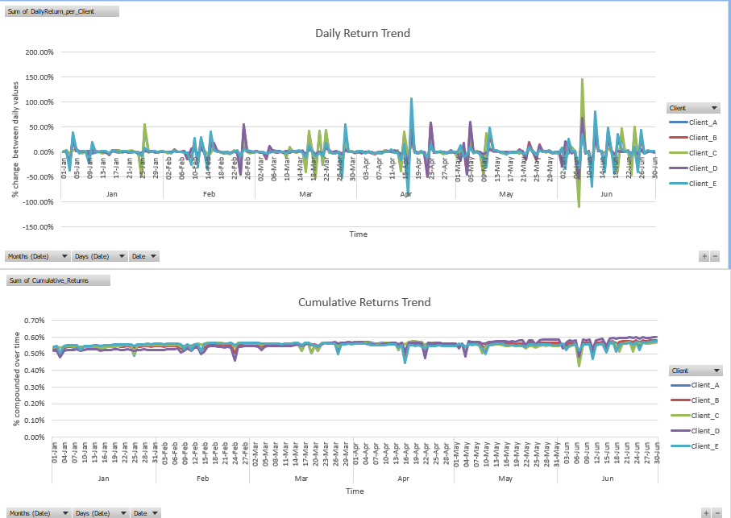
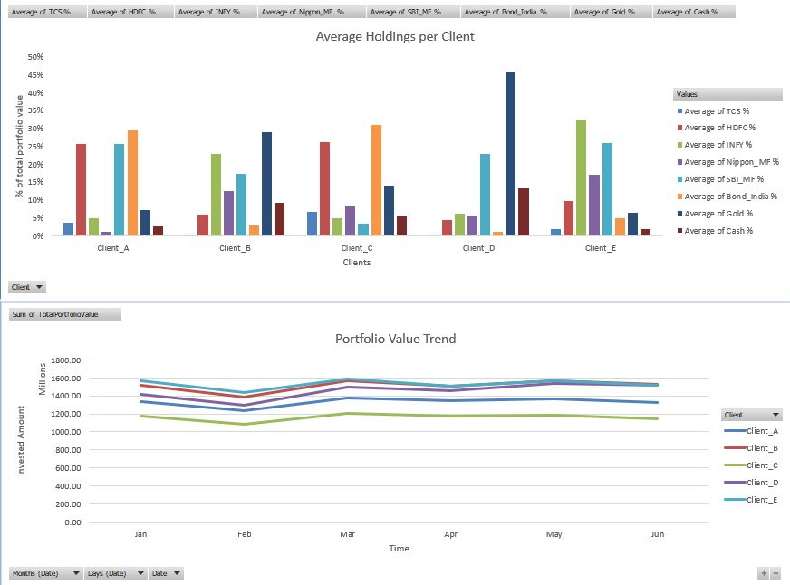
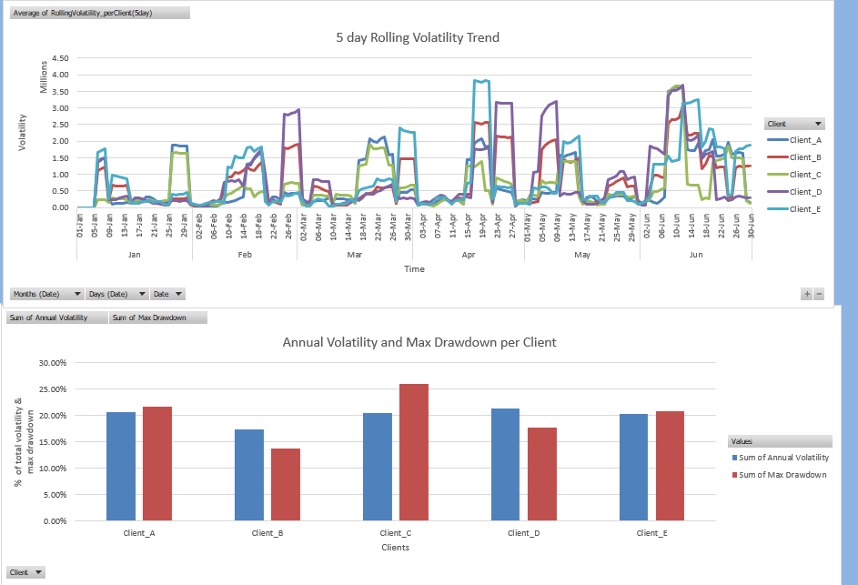
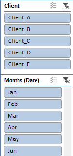

# Investor Portfolio Risk Dashboard (Excel Project)

## Objectives 

Analyzing and tracking asset data of 5 fictional clients to yield risk, return analysis of each client and compare performance of each client's porfolio.

## Tools & Techniques Used

- **Microsoft Excel**
  - Conditional Formatting
  - Data Cleaning : Datatypes, Missing Values, Outliers
  - Data Visualization : Charts, Slicers, PivotCharts
  - Advanced Excel formulas: `VLOOKUP`, `XLOOKUP`, `IFERROR`, `SUMIFS`, `INDEX-MATCH`

## Dashboard Features

-  Daily Returns & Cumulative Returns trend analysis 

-  Portfolio allocation visualization

-  Risk/return trend analysis + volatility estimates per client

-  Slicers to focus on each client and time(month)

  

## Skills Demonstrated

| Category       | Skills                                       |
|----------------|----------------------------------------------|
| Data Cleaning  | Dataypes, missing values, outliers, handling duplicates, structuring raw tables |
| Analysis       | Portfolio returns, allocation %, volatility  |
| Presentation   | Interactive dashboards   |
| Excel Mastery  | VLOOKUP, XLOOKUP, SUMIFS, data validation, PivotTables |

## Future Improvements

- Power Query application
- Adding macro-enabled PDF report generation  
- Simulating live market data (via Python extension + large Kaggle dataset)  
- Comparing portfolio returns to Nifty 50 benchmark  

