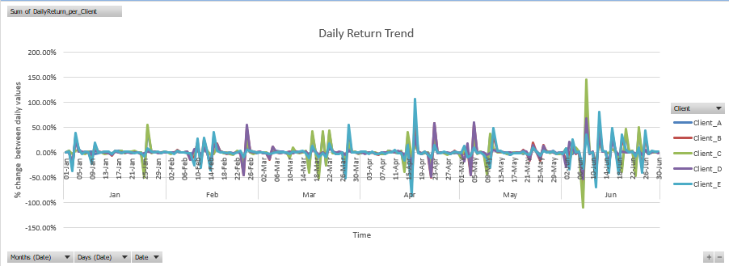

# Investor Portfolio Risk Dashboard (Excel Project)

### Project Type: Excel Dashboard  
### Domain: Finance  

---

## Objectives

- Analyzing multiple investors’ asset allocations across stocks, bonds, mutual funds, gold, and cash  
- Tracking portfolio performance over time using daily asset price data  
- Evaluating portfolio risk using metrics like volatility and diversification  
- Building a clean, interactive Excel dashboard for insights and presentation  

---

## Tools & Techniques Used

- **Microsoft Excel**
  - Conditional Formatting
  - Data Cleaning : Datatypes, Missing Values, Outliers
  - Data Visualization : Charts, Slicers, PivotCharts
  - Advanced Excel formulas: `VLOOKUP`, `XLOOKUP`, `IFERROR`, `SUMIFS`, `INDEX-MATCH`

---

## Dashboard Features

-  Daily Returns trend analysis 

-  Cumulative Returns trend analysis
-  Portfolio allocation visualization
-  Risk/return trend analysis + volatility estimates per client 
-  Slicers to focus on each client and time(month)

---

## Skills Demonstrated

| Category       | Skills                                       |
|----------------|----------------------------------------------|
| Data Cleaning  | Dataypes, missing values, outliers, handling duplicates, structuring raw tables |
| Analysis       | Portfolio returns, allocation %, volatility  |
| Presentation   | Interactive dashboards   |
| Excel Mastery  | VLOOKUP, XLOOKUP, SUMIFS, data validation, PivotTables |

---

## Future Improvements

- Power Query application
- Adding macro-enabled PDF report generation  
- Simulating live market data (via Python extension + large Kaggle dataset)  
- Comparing portfolio returns to Nifty 50 benchmark  

